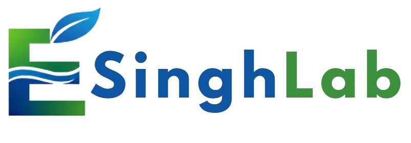

<div align="center">
  <br />
  <a href="https://sample-singhlab.vercel.app">
    
  </a>
  <br />
  <h1 align="center" style="font-size: 2.5rem; font-weight: 700; letter-spacing: -0.02em;">SinghLab</h1>
  <p align="center" style="font-size: 1.1rem; max-width: 540px; color: #666;">
    A bilingual research lab website for showcasing environmental research, publications, projects, team members, and community engagement — with a full-featured admin dashboard.
  </p>
  <br />
  <p align="center">
    <a href="https://sample-singhlab.vercel.app"><strong>🌐 Live Website</strong></a> &nbsp;·&nbsp;
    <a href="#-features"><strong>Features</strong></a> &nbsp;·&nbsp;
    <a href="#-tech-stack"><strong>Tech Stack</strong></a> &nbsp;·&nbsp;
    <a href="#-getting-started"><strong>Setup</strong></a>
  </p>

  <p align="center">
    
    
    
    
    
    
    
    
    
    
  </p>
</div>

---

## 📖 Overview

**SinghLab** is a production-grade, bilingual (English / Japanese) research lab website designed for environmental research groups, academic labs, and scientific institutions. It serves as a comprehensive digital presence for showcasing research activities, publications, team members, projects, and community outreach initiatives.

The platform features a **dynamic public website** with a slideshow hero section, research highlights, team profiles, project showcases, publication listings, and a gallery — all powered by a **full-featured admin dashboard** for content management.

Built with Next.js 16, Drizzle ORM with Neon PostgreSQL, Cloudinary for media management, and TipTap for rich text editing, SinghLab delivers a modern, responsive, and bilingual user experience that keeps content fresh through database-driven administration.

---

## ✨ Features

### 🌐 Public Website
| Feature | Details |
|---|---|
| **Slideshow Hero** | Full-screen rotating hero slides with animated transitions, navigation arrows, and dot indicators — content managed via admin dashboard |
| **Research Themes** | Dynamic research theme cards with icons, descriptions, and database-driven content |
| **Research Focus** | Highlighted research focus areas with rich descriptions and imagery |
| **Team Members** | People directory with filtering by role (Professor, Graduate Students, Undergraduate Students) |
| **Projects** | Project listing with detail pages, rich descriptions, and image support |
| **Publications** | Publication listing page with database-managed content |
| **Collaborators** | Collaborator showcase section with logos and organization details |
| **Activities** | Lab activities and news section with database-driven updates |
| **Gallery** | Image gallery with categories, managed through the admin dashboard |
| **Contact Form** | Public contact form with database persistence and admin inbox |
| **About Section** | Lab mission, vision, and background information |
| **Bilingual Support** | Full English / Japanese language toggle throughout the entire website |

### 🔐 Admin Dashboard
| Feature | Details |
|---|---|
| **Authentication** | Secure login with bcrypt password hashing and session management |
| **Hero Management** | Add, edit, delete, and reorder hero slides with images and text |
| **Activity Management** | CRUD for lab activities, news, and announcements |
| **Collaborator Management** | Manage collaborator organizations with logos and details |
| **Contact Inbox** | View and manage incoming contact form submissions |
| **CV Download** | CV/PDF document download functionality |
| **Document Proxy** | Secure document delivery proxy service |
| **Gallery Management** | Upload, categorize, and manage gallery images with Cloudinary integration |
| **Gallery Categories** | Create and manage gallery categories for organized image display |
| **People Management** | Manage team members with roles, biographies, images, and social links |
| **Project Management** | Full CRUD for research projects with rich text descriptions and images |
| **Publication Management** | Manage academic publications with metadata and document links |
| **Research Management** | Manage research focus areas and detailed research content |
| **Research Theme Management** | Create and manage research theme cards with icons |
| **Team Management** | Manage lab team structure and member details |
| **Image Upload** | Cloudinary-powered image upload with compression and optimization |

### 🌍 Bilingual Architecture
| Feature | Details |
|---|---|
| **Language Context** | React context-based language switching across all components |
| **Translation System** | Database-backed translation management with key-value pairs |
| **Dynamic Translations** | Client-side dynamic translation loading for seamless switching |
| **Consistent UI** | All components, navigation, and content respond to the selected language |

---

## 🛠 Tech Stack

<div align="center">

| Category | Technology |
|---|---|
| **Framework** | [Next.js 16](https://nextjs.org/) (App Router, Turbopack) |
| **Runtime** | [Node.js](https://nodejs.org/) |
| **Language** | [TypeScript](https://www.typescriptlang.org/) |
| **UI Library** | [React 19](https://react.dev/) |
| **Styling** | [Tailwind CSS](https://tailwindcss.com/) + [@tailwindcss/typography](https://tailwindcss.com/docs/typography-plugin) |
| **Database** | [PostgreSQL](https://www.postgresql.org/) via [Neon](https://neon.tech/) serverless |
| **ORM** | [Drizzle ORM](https://orm.drizzle.team/) with `drizzle-kit` migrations |
| **Image Hosting** | [Cloudinary](https://cloudinary.com/) with `next-cloudinary` |
| **Rich Text Editor** | [TipTap](https://tiptap.dev/) (StarterKit, Color, Highlight, TextAlign, TextStyle) |
| **Animations** | [Framer Motion](https://www.framer.com/motion/) + [AnimatePresence](https://www.framer.com/motion/animate-presence/) |
| **Icons** | [Lucide React](https://lucide.dev/) |
| **PDF Generation** | [jsPDF](https://github.com/parallax/jsPDF) + [jsPDF-AutoTable](https://github.com/simonbengtsson/jsPDF-AutoTable) |
| **Image Processing** | [Browser Image Compression](https://www.npmjs.com/package/browser-image-compression) + [html2canvas](https://html2canvas.hertzen.com/) |
| **Image Cropping** | [React Easy Crop](https://www.npmjs.com/package/react-easy-crop) |
| **Image Upload** | [next-cloudinary](https://next.cloudinary.dev/) CldUploadButton |
| **Authentication** | Custom auth with bcryptjs password hashing |
| **Deployment** | [Vercel](https://vercel.com/) |

</div>

---

## 📁 Project Architecture

```
singh/
├── app/                          # Next.js 16 App Router
│   ├── layout.tsx                # Root layout (fonts, providers, header, footer)
│   ├── globals.css               # Global Tailwind styles
│   ├── page.tsx                  # Homepage (hero, about, research, collaborators, gallery, contact)
│   ├── all-gallery/              # Full gallery view page
│   ├── collaborators/            # Collaborators page
│   ├── login/                    # Admin login page
│   │   └── dashboard/            # Admin dashboard (protected)
│   ├── our-team/                 # Team page
│   ├── people/                   # People directory with role filtering
│   ├── projects/                 # Projects listing
│   │   └── [id]/                 # Individual project detail
│   ├── publications/             # Publications listing
│   ├── research/                 # Research listing
│   │   └── [id]/                 # Individual research detail
│   └── api/                      # API routes
│       ├── activities/           # Activities CRUD
│       ├── auth/                 # Authentication endpoints
│       ├── collaborators/        # Collaborators CRUD
│       ├── contact/              # Contact form submission
│       ├── cv-download/          # CV PDF download
│       ├── document-proxy/       # Secure document proxy
│       ├── gallery/              # Gallery images CRUD
│       ├── gallery-categories/   # Gallery categories CRUD
│       ├── hero/                 # Hero slides CRUD
│       ├── people/               # People/team CRUD
│       ├── projects/             # Projects CRUD
│       ├── publications/         # Publications CRUD
│       ├── research/             # Research CRUD
│       ├── research-themes/      # Research themes CRUD
│       ├── team/                 # Team management CRUD
│       └── upload/               # Image upload endpoint
├── components/                   # Shared React components
│   ├── header.tsx                # Sticky header with navigation, language switcher, marquee
│   ├── footer.tsx                # Footer with links and branding
│   ├── hero.tsx                  # Slideshow hero with Framer Motion animations
│   ├── about.tsx                 # About lab section
│   ├── activities.tsx            # Lab activities/news section
│   ├── collaborator.tsx          # Collaborator showcase
│   ├── contact.tsx               # Contact form section
│   ├── gallery.tsx               # Gallery section
│   ├── ourteam.tsx               # Our team section
│   ├── people.tsx                # People directory
│   ├── project.tsx               # Project card component
│   ├── researchfocus.tsx         # Research focus section
│   ├── researchtheme.tsx         # Research themes section
│   ├── admin/                    # Admin dashboard components
│   ├── gallery/                  # Gallery-related components
│   ├── projects/                 # Project-related components
│   ├── publications/             # Publication-related components
│   └── research/                 # Research-related components
├── lib/                          # Business logic & utilities
│   ├── db/                       # Database schema, queries, and migrations
│   ├── cloudinary.ts             # Cloudinary configuration
│   ├── dbTranslations.ts         # Database translation helpers
│   ├── documentProxyUtils.ts     # Document proxy utilities
│   ├── dynamicTranslations.ts    # Dynamic translation loading
│   ├── imageUploadCompression.ts # Image compression utilities
│   ├── LanguageContext.tsx        # React context for language state
│   ├── test-db.ts                # Database connection test
│   ├── translations.ts           # Static translation strings
│   ├── translations_new.ts       # Updated translation strings
│   └── useScrollToSection.ts     # Scroll-to-section hook
├── drizzle/                      # Drizzle ORM migrations & meta
├── public/                       # Static assets
│   ├── logo2.png                 # Lab logo
│   ├── research.jpg              # Research imagery
│   ├── researchfocus.png         # Research focus image
│   ├── image.png                 # Generic image asset
│   ├── galleryimages/            # Gallery images
│   ├── heroimages/               # Hero background images
│   ├── ourteamimages/            # Team member images
│   ├── projectimages/            # Project images
│   └── researchimages/           # Research images
├── drizzle.config.ts             # Drizzle Kit configuration
├── tailwind.config.ts            # Tailwind theme customization
└── package.json                  # Dependencies & scripts
```

---

## 🚀 Getting Started

### Prerequisites

- [Node.js](https://nodejs.org/) (v20+)
- [pnpm](https://pnpm.io/) (recommended) or npm
- A [Neon](https://neon.tech/) (PostgreSQL) database instance
- A [Cloudinary](https://cloudinary.com/) account for image uploads

### Environment Variables

Create a `.env.local` file in the project root:

```env
# Database
DATABASE_URL=postgresql://<user>:<password>@<neon-host>/<db>?sslmode=require

# Cloudinary
NEXT_PUBLIC_CLOUDINARY_CLOUD_NAME=your_cloud_name
CLOUDINARY_API_KEY=your_api_key
CLOUDINARY_API_SECRET=your_api_secret
CLOUDINARY_UPLOAD_PRESET=your_upload_preset

# Admin Authentication
ADMIN_USERNAME=admin
ADMIN_PASSWORD_HASH=your_bcrypt_hashed_password
```

### Installation & Setup

```bash
# 1. Install dependencies
pnpm install

# 2. Push the database schema
pnpm db:push

# 3. Start the development server
pnpm dev
```

Open [http://localhost:5000](http://localhost:5000) to view the website. Access the admin dashboard at `/login` and `/login/dashboard`.

### Available Scripts

| Script | Description |
|---|---|
| `pnpm dev` | Start development server with Turbopack (port 5000) |
| `pnpm build` | Production build |
| `pnpm start` | Start production server (port 5000) |
| `pnpm lint` | Run ESLint |
| `pnpm db:push` | Push Drizzle schema to database |

---

## 🎨 Design & UX Highlights

- **Bilingual interface** (English / Japanese) with seamless language switching via React context
- **Slideshow hero** with full-screen background images, animated text transitions, auto-rotation, and manual navigation controls
- **Marquee ticker** in the header with animated scrolling research highlights
- **Responsive navigation** with desktop dropdown menus (People categories) and mobile hamburger menu with full support
- **Clean, academic aesthetic** with a black top bar, blue navigation (#2563eb), and professional typography using Geist + Playfair Display
- **Animated section entries** using Framer Motion for smooth page transitions
- **Rich text editing** with TipTap for content management in the admin dashboard
- **Image optimization** with Cloudinary delivery and browser-side compression
- **Smooth scroll navigation** with section-based URL parameters for direct linking
- **Interactive gallery** with category-based organization

---

## 🖥 Admin Dashboard

The admin dashboard (accessible at `/login`) provides comprehensive content management capabilities:

- **Hero Slides** — Upload background images, set headings and subheadings for the rotating hero carousel
- **Activities** — Post lab news, events, and announcements
- **Collaborators** — Add logos and descriptions of partner organizations
- **Contact Messages** — View and respond to contact form submissions
- **Gallery** — Upload and categorize images for the public gallery
- **People** — Manage team members with photos, roles (Professor, Graduate, Undergraduate), and biographies
- **Projects** — Create and edit research projects with rich text descriptions
- **Publications** — List academic papers and publications
- **Research** — Manage research focus areas with detailed content
- **Research Themes** — Configure theme cards with icons and descriptions
- **Team** — Manage overall team structure

---

## 🔒 Security & Access Control

- **Password-protected admin** with bcryptjs password hashing
- **Authentication endpoint** at `/api/auth` for secure admin login
- **Environment-based secrets** for database, Cloudinary, and admin credentials
- **Secure document proxy** for controlled file delivery
- **SQL injection protection** through Drizzle ORM's parameterized queries
- **Server-side API routes** protect all database operations from direct client access

---

## 🗺 Roadmap

- [ ] Multi-language support expansion (additional languages beyond English/Japanese)
- [ ] Real-time activity feed with WebSocket updates
- [ ] Publication import from Google Scholar / ORCID
- [ ] Advanced analytics dashboard for page views and engagement
- [ ] Search functionality across publications, projects, and team members
- [ ] Social media integration and sharing
- [ ] Event calendar for conferences and seminars
- [ ] Newsletter subscription and email notifications
- [ ] Research data repository and dataset sharing
- [ ] Student thesis showcase section

---

## 📄 License

This project is developed for **SinghLab** and is not licensed for public commercial use. All rights reserved.

---

<div align="center">
  <p>
    Built with ☕ and ❤️ for research and education
  </p>
  <p>
    <a href="https://sample-singhlab.vercel.app"><strong>🌐 Visit Live Site</strong></a>
  </p>
</div>